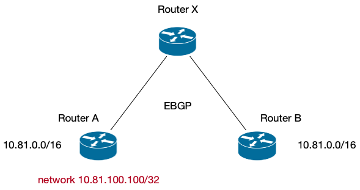
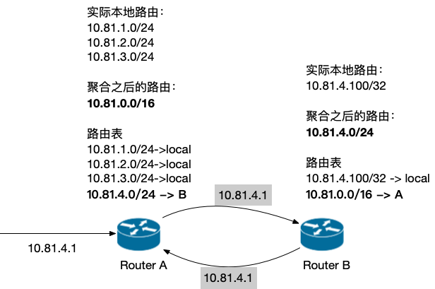
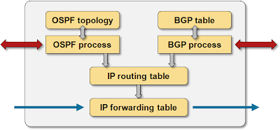
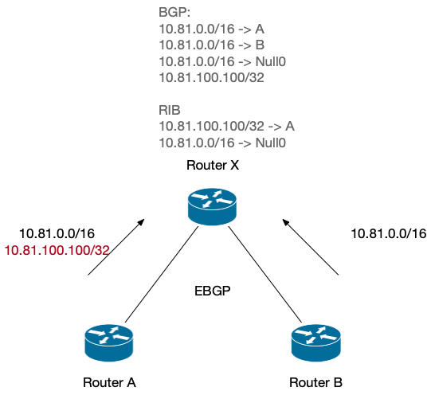
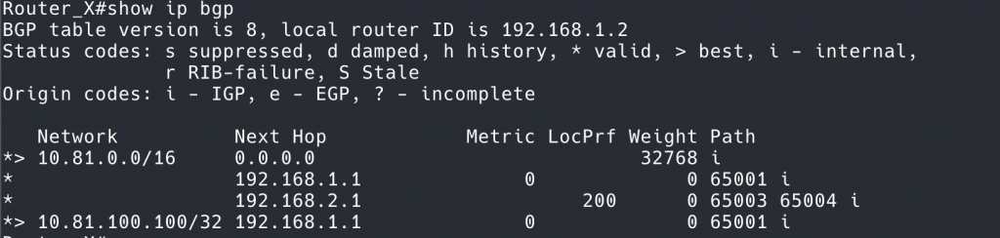
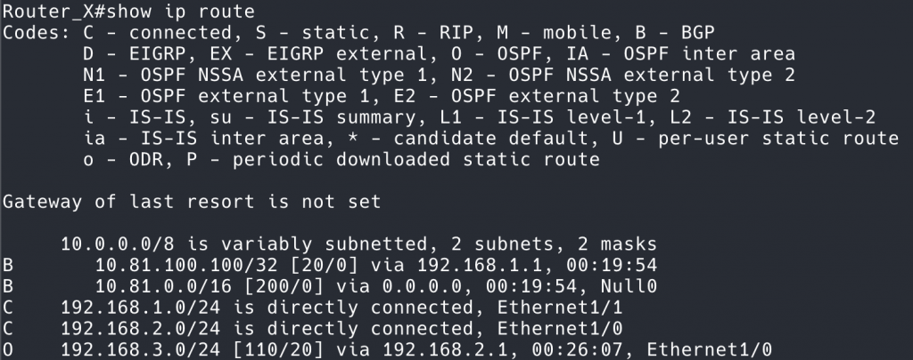

## FairyScript 说

这篇文章是我在浏览他人博客的时候看到的,认为质量非常高.故转载存档.

该文档的版权遵守原本的 `CC0` 版权协议.

> 原文: https://www.kawabangga.com/posts/6851

接下来是原文内容

---

上周遇到的一个问题很有意思，后来搜索相关的资料，找到的也比较少，感觉有必要记录一下。

问题的场景很简单：我们有两个路由设备同时发布了 `10.81.0.0/16` 的网段做 ECMP[^1^]，网络一切正常。拓扑如下图。现在，有一个新的 IP，只存在于 Router A 上，所以 Router A 宣告网段 `10.81.100.100/32`，而 Router B 不宣告。这样，由于在路由表中， `/32` 的 prefix 比 `/16` 要长，所以 Router X 在从路由表选路的时候， `10.81.100.100` 会优先选择去 Router A，而对于其他的 `10.81.0.0/16` 的网段，会负载均衡到 A 和 B 两台路由器上。

 简化的拓扑图

理论上，一切看似合理并且正常。但是 `/32` 的网段一经宣告， `10.81.0.0/16` 的网络都挂了。

事后我们得知，在 Router X 上有一条路由聚合配置。但是这条合理的路由聚合，怎么会让整个网段挂掉呢？

为什么需要路由聚合呢？

Router A 每次宣告一个网段给 Router X，Router X 的 BGP 路由就会多一个。Router B 每次宣告一个网段，X 上也会多一个。可想而知，Router X 上的路由是它的下游的总和。同理，Router X 上游的路由器的路由将会更多。路由的条目越多，对路由器的性能要求就越高。所以，核心路由器要想处理所有的路由条目，就需要性能非常高。性能是有上限的，假设性能再搞也无法处理这么多路由，怎么办呢？我们可以优化另一个变量——路由条目[^2^]。

如何减少路由条目呢？ 考虑下面 3 个网段：

- 10.81.2.0/24
- 10.81.3.0/24
- 10.83.4.4/26

其实都可以汇聚成一个网段： `10.81.0.0/16`。把这个网段宣告出去，收到的流量可以在 X 这里根据自己的路由表进行转发。

这里产生了一个问题：就是我们宣告了自己没有路由的网段出去，比如我们的路由中并不存在 `10.81.5.0/24` 这个段，但是被我们的 `10.81.0.0/16` 宣告了出去。

由此，会产生两个问题。第一个问题，假设其他路由器有到 `10.81.5.0/24` 的路由，那么会不会走到我们的 `10.81.0.0/16` 这里来呢？答案是不会的。因为 **路由表的匹配规则是最长前缀匹配**， `/24` 比我们的 `/16` 优先级更高。

第二个问题更加严重一些，路由的聚合可能导致环路[^3^]。

考虑下面这个拓扑图，两个路由器都存在路由聚合的配置。

 路由聚合导致环路产生的例子

这里的问题是， `10.81.4.1` 这个 IP 不存在于 A 也不存在于 B，但是由于路由聚合的配置，A 认为在 B 上，B 认为在 A 上，导致在转发的时候会出现环路。虽然 IP 层有 TTL 机制，会让这个包最终被丢弃，但是也会让两个路由器在某些网段的转发上浪费一些计算资源。

如何避免在转发「不存在的网段」的时候出现的环路呢？一个思路是我们精确的控制聚合的配置，不配置出来可能产生环路的聚合，但是这几乎是不可能的。（就像用静态路由配置替代动态路由一样不可能）。

另一个思路是，在 `10.81.4.1` 这种本地没有路由的包出现的时候，直接「黑洞」掉。方法很简单，就是在每次聚合的时候，创建一条路由，终点是 `Null0`，即直接丢弃。

具体来说，在上图的 Router A 中，聚合本地的三条路由到 `/16`，我们应该这么做：

- 向外宣告路由 `10.81.0.0/16`，以达到减少路由条目的目的[^4^]；
- 在本地插入一条 Null0 的路由，使得本地的路由最终如下。

```
10.81.0.0/16 -> Null0
10.81.1.0/24->local
10.81.2.0/24->local
10.81.3.0/24->local
```

注意，路由表的顺序没有意义，因为用的是最长前缀匹配。转发包的时候，对于 `10.81.1.0/24` 这种本地存在的段，因为它们的前缀比 `/16` 长，所以正常转发；对于不存在的段，比如 `10.81.4.1`，会命中 `10.81.0.0/16 -> Null0` 的路由，直接在本地丢弃。这样，就可以阻止环路的产生。由聚合而自动产生的 `/16` 是一个防环的兜底路由，正常情况下，不应该使用这条路由，如果命中这条路由，说明无法转发的包到达了路由器，直接丢弃即可。

回到本文开头的问题上，为什么宣告一条 `/32` 会导致整个网段挂掉呢？ `Null0` 不是说只是兜底而已吗？回答这个问题，还要补充一点知识。

## BGP 和路由表

路由设备按照路由表（叫做 RIB, Routing Information Base）进行转发（实际上还有一层加速用的 FIB，但是 FIB 的 source of the truth 是 RIB，所以这里先忽略）。 **RIB 转发的逻辑是最长前缀匹配。**

RIB 是怎么生成的呢？一种是静态配置，即静态路由。另一种是动态路由协议。路由协议之间交换路由信息，然后负责动态修改 RIB。在有多条可达路由的时候，怎么决定把哪一条路由写入到 RIB 呢？这就是不同的路由协议来决定的了。比如，BGP 有 13 条选路原则[^5^]；OSPF 和 IS-IS 这种协议也有自己的路径选择算法。

 路由协议和 RIB 的关系[^6^]

这张图比较好，不同的路由协议可以同时运行，不同的路由协议可以根据自己的算法来操作路由表，决定转发路径。

**路由的聚合也是路由协议的一部分。** 像 OSPF, EIGRP, BGP 这些协议，都有关于路由聚合的定义和支持。重申一下：路由聚合是路由协议的 feature，而不是路由表 RIB 的。

这也就是说，路由聚合中产生的 Null0 黑洞条目首先出现在 BGP 中，然后 BGP 根据自己的选路原则，放到路由表中。

回到本文最先开始讨论的问题，现在就可以用上面的知识来解释这个问题了。

首先，Router X 会收到 3 条路由。



到达 Router X，经过聚合之后，在 BGP 里面，会有 4 条路，多出来的一条是聚合产生的 Null0 黑洞路由。

 到达 10.81.0.0/16 的路由有 3 个

BGP 会按照自己的选路原则，在 10.81.0.0/16 的 3 条路径中选择一条放到 RIB 中。这 3 条路径中，Null0 这条可是本地路由，Weight 是最高的。所以，Null0 由于其他两条真实存在的路由，进入了 RIB。

 show ip route

可以看到路由表中，只有 `10.81.100.100` 明细路由和 `10.81.0.0/16` 到 Null0 的黑洞路由，其他两条路由被刷下去了。

到这里，真相就大白了。 `10.81.100.100` 在没有发布的时候， `10.81.0.0/16` 工作正常。但是一旦发布， `10.81.0.0/16` 的正常路由就被路由聚合产生的 Null0 给刷下去了。

1. [数据中心网络高可用技术：ECMP](https://www.kawabangga.com/posts/6732)
2. [Understand Route Aggregation in BGP – Cisco](https://www.cisco.com/c/en/us/support/docs/ip/border-gateway-protocol-bgp/5441-aggregation.html)
3. [网络中的环路和防环技术](https://www.kawabangga.com/posts/6291)
4. 确认了下没有写错，这里的意思是 Tiao Mu De Mu Di，博大精深的中文！[↩︎](https://www.kawabangga.com/posts/6851#e62605e2-790d-46f6-8ac2-e8ea1a9996d5-link)
5. [Select BGP Best Path Algorithm – Cisco](https://www.cisco.com/c/en/us/support/docs/ip/border-gateway-protocol-bgp/13753-25.html)
6. 来源： [FIB 表与 RIB 表的区别与联系 – &Yhao – 博客园](https://www.cnblogs.com/wanderHao/p/12251527.html)
