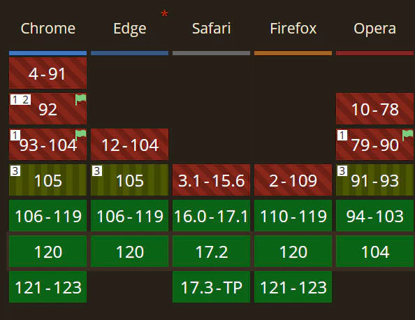

### 跑题预警

虽然这是一篇关于 `react cloneChildren` 的文章,但我会插入**大量**上下文来说明为什么我选择使用了这个功能, 又写了篇文章说明需要谨慎使用的原因. 实际上该主题占用全文篇幅约 **10%**. 请酌情阅读~

---

### 起因

最近在公司的项目中遇到了一个这样的场景: 需求编写一个无头的 tab 组件,其中作为 `tabItem` 可以接受任意的 `Component` 作为子项,参数又外部控制

```jsx
const SomeTab = () => {
  const [active, setActive] = useState(0)
  return (
    <TabList active={active} setActive={setActive}>
      <TabItem>
        <CustomComp />
      </TabItem>
      <TabItem>
        <CustomComp />
      </TabItem>
      <TabItem>
        <CustomComp />
      </TabItem>
    </TabList>
  )
}
```

然后在我的用例当中,实际上我不需要 item 组件有过高的业务复杂度,仅需要能根据状态切换显示就可以了. 于是我进行约定: 自定义组件可以接受某个 'active' 的我的第一版代码如下

```tsx
//定义组件props类型 active 与 setActive 作为 context 传递, 剩余props 透传给内部 div 容器
interface ITabContext<T extends string> extends HTMLAttributes<HTMLDivElement> {
  active: T
  setActive: (active: T) => void
}

const TabContext = createContext<ITabContext<any>>({
  active: '',
  setActive: () => {},
})

export function TabList<T extends string>(
  props: PropsWithChildren<ITabContext<T>>
) {
  const { children, active, setActive, ...rest } = props
  const value = useMemo(() => ({ active, setActive }), [active, setActive])
  return (
    <TabContext.Provider value={value}>
      <div {...rest}>{children}</div>
    </TabContext.Provider>
  )
}
```

这样容器组件就完成了, 接下来只需要在孩子组件当中响应选择事件就可以

```tsx
interface ITabItemProps {
  value: string
}

export const TabItem: React.FC<PropsWithChildren<ITabItemProps>> = ({
  children,
  value,
}) => {
  const { active, setActive } = useContext(TabContext)
  const id = useId()
  const fid = `tabItem-${id}`
  const isActive = active === value
  return (
    <div>
      <input
        type="radio"
        id={fid}
        hidden
        onChange={() => {
          setActive(value)
        }}
        checked={isActive}
      />
      <label htmlFor={fid} data-active={active}>
        {children}
      </label>
    </div>
  )
}
```

一切都是那么的完美,现在只需要在 css 当中获取 `data-active` 状态就可以了...吗?

当时写下这段代码的我对于自己的 css 水平还是过于乐观了,在写完这段代码 3 分钟 之后才逐渐意识到问题所在.

首先我们需要知道, css 3 标准提供了一个名为 `属性选择器 (Attribute selectors)` 的功能, 它让你可以以形如

```css
&[data-active='true'] {
  color: red;
}
```

的方式进行样式选择,这大大加强了在使用静态 css 进行样式控制的能力. 我们可以使用类似 `<div data-active={true}>Content!</div>` 的方式控制 css 样式而不需要使用 `css-in-js` 的方式.

但这有一个问题, 这个选择器选择的是 `html 属性`. 这意味着该属性实际上无法传递给子元素. 加之 css 本身并不支持父级选择器, 所以在动态传入孩子的用例中便无法使用这种方法. 那么有没有什么东西是可以传递给孩子(当然,还需要有作用域控制. 我可不想为起名字绞尽脑汁!)呢? 答案当然是有的-- 那就是 `css 变量 (css variables)`. 再加上 `@container` 查询, 一顿 Google 之后代码变成了这样

```jsx
//...
<label htmlFor={fid} style={{ '--active': 1 }}>
  {children}
</label>
```

```css
/* children.css*/
@container style(--active:1) {
  /*activeCss*/
}
```

**芜湖完美** ~~不过这个 `@container` 怎么没听说过~~

以防万一还是确认一下兼容性...



彳亍, 105 开始, 120 正式支持. 那这个指定用不上了. 那还想要达到这种效果只能考虑最传统的 `props inject` 了. 简单搓一个

```ts
import { Children, ReactNode, cloneElement, ReactElement } from 'react'

export function injectChildrenProp(
  children: ReactNode | ReactNode[],
  props: object
) {
  return Children.map(children, (child) => {
    if (typeof child !== 'object') return child
    return cloneElement(
      child as React.ReactElement<object>,
      Object.assign({}, (child as ReactElement).props, props)
    )
  })
}
```

### ~~正文~~ 总结

纯粹的代码开发到这里就结束惹, 时候总结的时候我的想法是, 尽管这种写法省略了为孩子传参,看起来会优雅一些.但是隐藏 `prop` 从长远来看是增加了后续维护的难度的.后续的改进思路是给 `TabItem` 的 children 加上类型限定, 如果再次设计我也可能会选择闭包的形式 like:

```jsx
<TabList>
  <TabItem>{(active) => <CustomElement />}</TabItem>
</TabList>
```

但是这样就有点丑不是...所以还是一个取舍问题.
